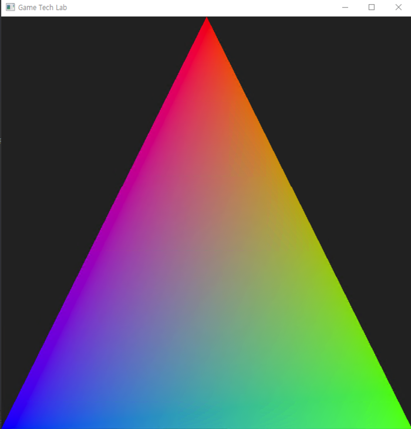

## 문제 정보
- 문제 링크: [SWEA union-find 문제](비공개)
- 난이도: <span style="color:#000000">pro</span>
- 완료일: 2025년 3월 17일
- 유형: Union-Find
- 특이사항: 삼성전자 교육 문제

### 틀린 코드

```C++
#include <iostream>
#include <vector>
#include <queue>

using namespace std;

int n;
int parent[100001];
int height[100001];
int score[100001];
vector<int> edge[100001];

int val;

//완탐하면서 점수 갱신
void DFS(int node, int prev)
{
	score[node] += val;

	int len = edge[node].size();
	for (int i=0; i<len; ++i)
	{
		int next = edge[node][i];

		if (next == prev) continue;
		DFS(next, node);
	}
}

int Find(int node)
{
	if (parent[node] == node)
		return node;
	
	return parent[node] = Find(parent[node]);
}

void init(int N)
{
	n = N;
	for (int i = 1; i <= n; ++i)
	{
		edge[i].clear();
		parent[i] = i;
		height[i] = 0;
		score[i] = 0;
	}
}

// 50,000회 호출
void updateScore(int mWinnerID, int mLoserID, int mScore)
{
	int p1 = Find(mWinnerID);
	int p2 = Find(mLoserID);
	
	val = mScore;
	DFS(p1, 0);

	val = -mScore;
	DFS(p2, 0);
}

void unionTeam(int mPlayerA, int mPlayerB)
{
	int p1 = Find(mPlayerA);
	int p2 = Find(mPlayerB);
	int h1 = height[p1];
	int h2 = height[p2];

	edge[p1].push_back(p2);
	edge[p2].push_back(p1);

	if (h1 == h2)
	{
		parent[p2] = p1;
		height[p1]++;
	}
	else if (h1 > h2)
	{
		parent[p2] = p1;
	}
	else // h1 < h2
	{
		parent[p1] = p2;
	}
}

int getScore(int mID)
{
	return score[mID];
}

```

시간 초과 코드. 60초가 걸린다…

같은 그룹의 점수를 Update 해주는 함수가 있고 최대 5만번 호출되는데, 이를 N이 아닌 시간에 해결해야 한다.   
현재 코드는 Update 마다 같은 집합인 그래프를 완전 탐색하면서 score를 직접 갱신하고 있다.   

### 맞춘 코드

```C++
#include <iostream>
#include <vector>
#include <queue>

using namespace std;

typedef pair<int, int> pii;

int n;
int parent[100001];
int height[100001];
int score[100001];
int diff[100001];

int Update(int node)
{
	if (parent[node] == node)
	{
		return score[node];
	}
	return score[node] = Update(parent[node]) + diff[node]; //path-compression에 어떻게 대응?
}

int Find(int node)
{
	if (parent[node] == node)
	{
		return parent[node];
	}
	//return parent[node] =  Find(parent[node]);	
	return Find(parent[node]); //경로압축 하지말기
}

void init(int N)
{
	n = N;
	for (int i = 1; i <= n; ++i)
	{
		parent[i] = i;
		height[i] = 0;
		score[i] = 0;
		diff[i] = 0;
	}
}

// 50,000회 호출
void updateScore(int mWinnerID, int mLoserID, int mScore)
{
	int p1 = Find(mWinnerID);
	int p2 = Find(mLoserID);
	
	score[p1] += mScore;
	score[p2] -= mScore;
}

void unionTeam(int mPlayerA, int mPlayerB)
{
	int p1 = Find(mPlayerA);
	int p2 = Find(mPlayerB);
	int h1 = height[p1];
	int h2 = height[p2];

	if (h1 == h2)
	{
		parent[p2] = p1;
		height[p1]++;

		diff[p2] = score[p2] - score[p1]; // 자식-부모 저장
	}
	else if (h1 > h2)
	{
		parent[p2] = p1;

		diff[p2] = score[p2] - score[p1];
	}
	else // h1 < h2
	{
		parent[p1] = p2;

		diff[p1] = score[p1] - score[p2];
	}
}

int getScore(int mID)
{
	return Update(mID);
}

```

경로 압축을 하면서 parent가 루트 노드를 가리키게 되기 때문에, diff를 정의하는게 불가능해진다.

경로 압축을 건너뛰고 height 기반의 최적화만 적용해서 union 하게 되면   
트리 높이가 log N 으로 유지되면서 부모 찾는 쿼리, 점수 찾는 쿼리에 모두 log N 으로 대응할 수 있다.  

*유니온 파인드 - height를 명시적으로 줘서 최적화했는데,  
height 없이 그룹 번호만으로 최적화해도 트리 깊이가 N이 되는 최악의 경우를 막을 수 있다.   
( 따로 줄 필요 없다. )  

**최적화** [](<image.png>)

(내 스코어 - 부모 스코어) 를 계산했고,  
  
_부모의 부모가 존재하는 경우, 부모 score를 내 점수에 더해서  
path compression 이후 루트 값과 자기 자신만 계산하면 값이 바로 나오도록 최적화 한다?  
_
